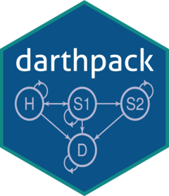

<!-- README.md is generated from README.Rmd. Please edit that file -->
[](https://zenodo.org/badge/latestdoi/197059951)

darthpack 
=======================================================================

<!--  -->
[`darthpack`](https://github.com/DARTH-git/darthpack) is an R package that showcases the [Decision Analysis in R for Technologies in Health (DARTH)](https://darthworkgroup.com) coding framework to construct model-based cost-effectiveness analysis in R. The main website of `darthpack` can be [found here](https://darth-git.github.io/darthpack/).

[`darthpack`](https://github.com/DARTH-git/darthpack) is part of the following manuscript:

-   Alarid-Escudero F, Krijkamp E, Pechlivanoglou P, Jalal H, Kao SY, Yang A, Enns EA. ["A need for change! A coding framework for improving transparency in decision modeling"](https://link.springer.com/article/10.1007%2Fs40273-019-00837-x). PharmacoEconomics 2019;37(11):1329–1339. <http://dx.doi.org/10.1007/s40273-019-00837-x>

- Shareable link: https://rdcu.be/bRP5h

The release that accompanies the published article has been archived in zenodo: <https://zenodo.org/record/3445451>.

Preliminaries
=============

-   Install [RStudio](https://www.rstudio.com/products/rstudio/download/)
-   Install `devtools` to install `darthpack` as a package and modify it to generate your own package

``` r
# Install release version from CRAN
install.packages("devtools")

# Or install development version from GitHub
# devtools::install_github("r-lib/devtools")
```

-   Install `pkgdown` to publish `darthpack` or your own `darthpack`-based repository or package as a website (optional)

``` r
# Install release version from CRAN
install.packages("pkgdown")

# Or install development version from GitHub
# devtools::install_github("r-lib/pkgdown")
```

Usage and installation
======================

`darthpack` repository could be used in at least three different ways:

1.  [GitHub coding template](#use-repository-as-a-github-coding-template) for using it to generate a repository of your own model-based decision or cost-effectiveness analysis linked to the original `darthpack` GitHub repository
2.  [Regular coding template](#use-repository-as-a-regular-coding-template) for using it to generate a repository of your own model-based decision or cost-effectiveness analysis
3.  [R package](#use-as-an-r-package) for using it as a standalone package to run current functions of `darthpack`

The main website of the package could be found in: <https://darth-git.github.io/darthpack/>

Use repository as a GitHub coding template
------------------------------------------

1.  Sign in to GitHub. You need to sign in to use this repository as a template. If you don’t have a GitHub account, you can [create one here](https://github.com/join).
2.  On the `darthpack` GitHub repository, navigate to the main page of the repository (<https://github.com/DARTH-git/darthpack>).
3.  Above the file list, click **Use this template**.
4.  Use the **Owner** drop-down menu, and select the account you want to own the repository.
5.  Type a name for your repository of your decision model, and an optional description.
6.  Choose to make the repository either public or private. Public repositories are visible to the public, while private repositories are only accessible to you, and people you share them with. For more information, see "[Setting repository visibility](https://help.github.com/en/articles/setting-repository-visibility)."
7.  Click **Create repository from template**.
8.  Either clone the repository or download it.
    1.  **Clone**, which requires the user to have a GitHub desktop installed, or
    2.  **Download zip** that will ask the user to download the whole repository as a .zip file.
9.  Open the RStudio project `darthpack.Rproj`.
10. Install all the required and suggested packages listed in the [*DESCRIPTION*](https://github.com/DARTH-git/darthpack/blob/master/DESCRIPTION) file in the main folder of the repository
    -   To install `dampack`, please follow these instructions:

``` r
# Install development version from GitHub
devtools::install_github("DARTH-git/dampack")
```

1.  In RStudio, load all the functions and data from the repository by typing `devtools::load_all(".")`
2.  Run all the decision modeling modules in the analysis folder.

Use repository as a regular coding template
-------------------------------------------

1.  On the `darthpack` GitHub repository, navigate to the main page of the repository (<https://github.com/DARTH-git/darthpack>).
2.  Above the file list, click **Clone or download** and select either
    1.  **Open in desktop**, which requires the user to have a GitHub desktop installed, or
    2.  **Download zip** that will ask the user to download the whole repository as a .zip file.
3.  Open the RStudio project `darthpack.Rproj`.
4.  Install all the required and suggested packages listed in the [*DESCRIPTION*](https://github.com/DARTH-git/darthpack/blob/master/DESCRIPTION) file in the main folder of the repository
    -   To install `dampack`, please follow these instructions:

``` r
# Install development version from GitHub
devtools::install_github("DARTH-git/dampack")
```

1.  In RStudio, load all the functions and data from the repository by typing `devtools::load_all(".")`
2.  Run all the decision modeling modules in the analysis folder.

Use as an R package
-------------------

1.  Install the development version of `darthpack` from [GitHub](https://github.com) with:

``` r
devtools::install_github("DARTH-git/darthpack")
```

1.  Load all the functions and data from the repository by typing

``` r
library(darthpack)
```

Release your updated framework
==============================

Once the framework has been modified and updated to your specific needs, run `pkgdown` from the package directory each time you release your package:

``` r
pkgdown::build_site()
```

For a more detailed description on how to quickly and easily build a website for your package, please go to <https://github.com/r-lib/pkgdown> and
