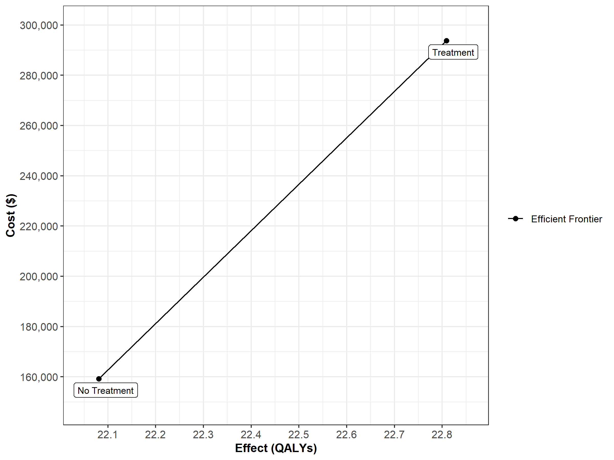
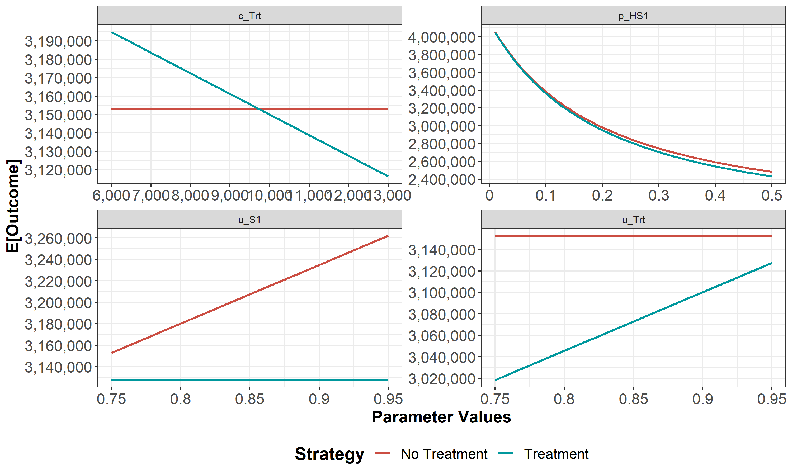
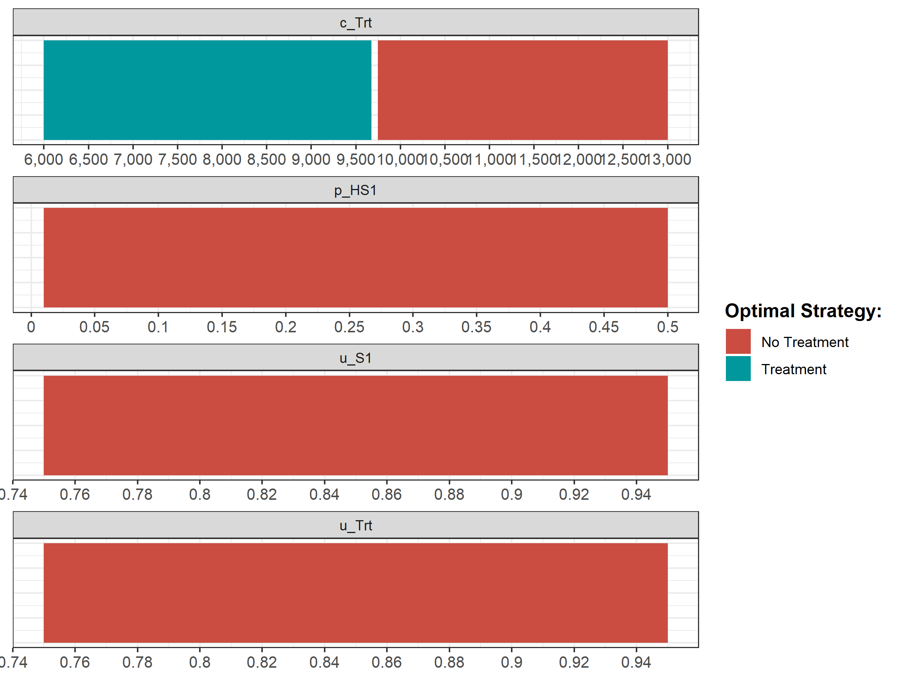
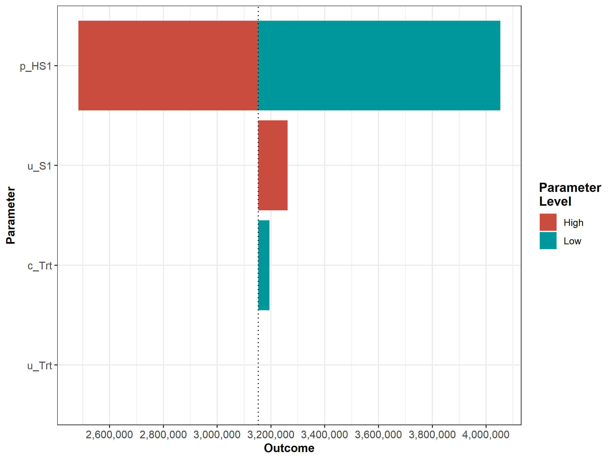
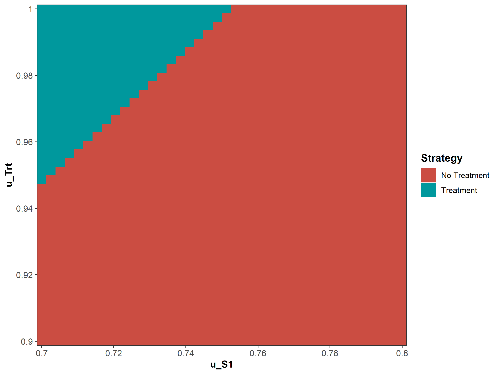

```{r, include = FALSE, warning = FALSE}
library(knitr)
# https://haozhu233.github.io/kableExtra/awesome_table_in_html.html
library(kableExtra)
library(dplyr)
library(reshape2)
library(ggplot2)
library(scales)   # for dollar signs and commas
library(dampack)
library(darthpack)
### Load parameters
l_params_all <- load_all_params()
```

# Analysis {#analysis}
The analysis component is where the elements in components 1-4 are combined to answer the question(s) of interest given current information and to quantify the value of potential further research. Our framework separates the analysis in three subcomponents: _05a Probabilistic analysis_, _05b Deterministic analysis_and _05c Value of information analysis_. For the Sick-Sicker case-study, we use all three subcomponents to conduct the CEA and to quantify the uncertainty of our decision. For procedures in the CEA, we rely on the `R` package `dampack`, which is available here: <https://github.com/DARTH-git/dampack>. To install `dampack`, please follow these instructions:

## 05a Probabilistic analysis {#Probabilistic-analysis} 
In this subcomponent, we evaluate decision uncertainty by propagating the uncertainty through the CEA using probabilistic sensitivity analysis (PSA). Until now we used the parameter values as described in Table \@ref(tab:parameters). However, we are uncertain about these values. Most of these input parameters are defined by probability distribution as described in Table \@ref(tab:parameters-PSA). 

Table: (\#tab:parameters-PSA) Description of parameters with their R name and distribution.

  |           **Parameter**         |  **R name** |   **Distribution**    |
  |:--------------------------------|:------------|:---------------------------------------------|
  | Annual transition probabilities |             |                       |
  | - Disease onset (H to S1)       | `p_HS1`     |  `beta(30, 170)`        |
  | - Recovery (S1 to H)            | `p_S1H`     |  `beta(60, 60)`         |
  | Annual costs                    |             |               |
  | - Healthy individuals           | `c_H`       |  `gamma(shape = 100, scale = 20)`        |
  | - Sick individuals in S1        | `c_S1`      |  `gamma(shape = 177.8, scale = 22.5)`       |
  | - Sick individuals in S2        | `c_S2`      |  `gamma(shape = 225, scale = 66.7)`     |
  | - Additional costs of sick individuals treated in S1 or S2           | `c.Trt`     |  `gamma(shape = 73.5, scale = 163.3)`      |
  | Utility weights                 |             |               |
  | - Healthy individuals           | `u_H`       |`truncnorm(mean = 1, sd = 0.01, b = 1)`         |
  | - Sick individuals in S1        | `u_S1`      |`truncnorm(mean = 0.75, sd = 0.02, b = 1)`         |
  | - Sick individuals in S2        | `u_S2`      |`truncnorm(mean = 0.50, sd = 0.03, b = 1)`         |
  | Intervention effect             |             |               |
  | - Utility for treated individuals in S1 | `u_Trt` |`truncnorm(mean = 0.95, sd = 0.02, b = 1)`        |
  
In a PSA we sample the input parameter values from these distributions and we then run the model at each sample. In the file *05a_probabilistic_analysis_functions.R* we created a single function, called `generate_psa_params`. This function generates a PSA dataset for all the CEA input parameters. We specify the number of PSA samples via the `n_sim` argument. The function also accepts specifying a seed to allow reproducibility of the results.

```{r, eval = TRUE, echo = TRUE}
print.function(generate_psa_params) # print the function 
```

The function returns the `df_psa_input` dataframe with a PSA dataset of the input parameters. With this dataframe we can run the PSA to produce distributions of costs, effectiveness and NMB. The PSA is performed by the  *05a_probabilistic_analysis.R* script. As shown in the code below, the `df_psa_input` dataframe is used by the `update_param_list` function to generate the corresponding list of parameters for the PSA. For each simulation, we perfrom three steps. First, the list of parameters is updated by the `update_param_list` function. Second, the model is executed by the `calculate_ce_out` function using the updated parameter list and third, the dataframes `df_c` and `df_e` store the estimated cost and effects, respectively. The final part of this loop is to satisfy the modeler when waiting on the results, by displaying the simulation progress.  

```{r, eval = FALSE, echo = TRUE}
for(i in 1:n_sim){ 
  l_psa_input <- update_param_list(l_params_all, df_psa_input[i, ])
  df_out_temp <- calculate_ce_out(l_psa_input)
  df_c[i, ] <- df_out_temp$Cost
  df_e[i, ] <- df_out_temp$Effect
  # Display simulation progress
  if(i/(n_sim/10) == round(i/(n_sim/10), 0)) {
    cat('\r', paste(i/n_sim * 100, "% done", sep = " "))
  }
}
``` 

We can plot the results using the `plot` function from `dampack`. Figure \@ref(fig:05a-CEAplane) shows the CE scatter plot with the joint distribution of costs and effects for each strategy and their corresponding 95% confidence ellipse. 

```{r 05a-CEAplane, out.width='100%', fig.cap="The cost-effectiveness plane graph showing the results of the probabilistic sensitivity analysis for the Sick-Sicker case-study.", echo=FALSE}
knitr::include_graphics("../figs/05a_cea_plane_scatter.png")
```

```{r df-cea-prob, eval = TRUE, echo = FALSE}
df_cea_psa <- read.csv(file = "./tables/05a_probabilistic_cea_results.csv")[, c(-1, -8)]
# load("../tables/05a_probabilistic_cea_results.RData")
knitr::kable(df_cea_psa[, -7], caption = "Probabilistic cost-effectiveness analysis results of the Sick-Sicker model comparing no treatment with treatment") %>% 
  kable_styling(latex_options = c("hold_position"))
``` 
Next, we perform a CEA using the previously used `calculate_icers` functions from `dampack`. Table \@ref(tab:df-cea-prob) shows the results of the probabilistic CEA. In addition, we plot a cost-effectiveness plane with the frontier, the cost-effectiveness acceptability curves (CEACs) and frontier (CEAF), expected Loss curves (ELCs) (Figures \@ref(fig:05a-cea-frontier-psa) - \@ref(fig:05a-elc)) [@Alarid-Escudero2019]. Followed by creating linear regression metamodeling sensitivity analysis graphs (Figures \@ref(fig:05a-owsa-lrm-nmb) - \@ref(fig:05a-twsa-lrm-uS1-uTrt-nmb))[@Jalal2013]. All generated figures are shown below and stored to the *figs* folder . 

```{r 05a-cea-frontier-psa, out.width='100%', fig.cap = "Cost-effectiveness frontier", echo = FALSE }
knitr::opts_knit$set(root.dir = '..')
knitr::include_graphics("../figs/05a_cea_frontier_psa.png")
```

```{r 05a-ceac-ceaf, out.width='100%', fig.cap= "Cost-effectiveness acceptability curves (CEACs) and frontier (CEAF).", echo = FALSE}
knitr::opts_knit$set(root.dir = '..')

```

```{r 05a-elc, out.width='100%', fig.cap="Expected Loss Curves.", echo = FALSE}
knitr::opts_knit$set(root.dir = '..')

```

```{r 05a-owsa-lrm-nmb, out.width='100%', fig.cap = "One-way sensitivity analysis (OWSA).", echo = FALSE}
knitr::opts_knit$set(root.dir = '..')

```

```{r 05a-optimal-owsa-lrm-nmb, out.width='100%', fig.cap = "Optimal strategy with OWSA", echo=FALSE}
knitr::opts_knit$set(root.dir = '..')
knitr::include_graphics("../figs/05a_optimal_owsa_lrm_nmb.png")
```

```{r 05a-tornado-lrm-Treatment-nmb, out.width='100%', fig.cap="Tornado plot", echo=FALSE}
knitr::opts_knit$set(root.dir = '..')

``` 

```{r 05a-twsa-lrm-uS1-uTrt-nmb, out.width='100%', fig.cap = "Two-way sensitivity analysis (TWSA).", echo=FALSE}
knitr::opts_knit$set(root.dir = '..')
knitr::include_graphics("../figs/05a_twsa_lrm_uS1_uTrt_nmb.png")
```

## 05b Deterministic analysis {#Deterministic-analysis}
In this subcomponent, we perform a deterministic CEA, followed by some deterministic sensitivity analysis, including one-way, two-way and tornado sensitivity analyses. The function script of this subcomponent, *05b_deterministic_analysis_function.R*, contains the function `calculate_ce_out`. This function calculates costs and effects for a given vector of parameters using a simulation model. We need to run our simulation model using the calibrated parameter values, but the list we created in component 01 (\@ref(inputs)) still contain the placeholder values for the calibrated parameters. This means we need to update these values by the calibrated values stored in the vector `v_calib_post_map`. The function `update_param_list` updates the list of parameters with new values for some specific parameters. 

```{r}
print.function(update_param_list)
``` 

The first argument of the function, called `l_params_all`, is a list with all the parameters of decision model. The second argument, `params_updated`, is an object with parameters for which values need to be updated. The function returns the list `l_params_all` with updated values. 

In the *05b_deterministic_analysis.R* script we execute the `update_param_list` function for our case-study, resulting in the list `l_params_basecase` where the placeholder values for `p_S1S2`, `hr_S1` and `hr_S2` are replaced by the calibration estimates. 

```{r, eval = TRUE, echo = TRUE}
l_params_basecase <- update_param_list(l_params_all, v_calib_post_map) 
```
We use this new list as an argument in the `calculate_ce_out` function. In addition, we specify the willingness-to-pay (WTP) threshold value using the `n_wtp` argument of this function. This WTP value is used to compute a net monetary benefit (NMB) value. If the user does not specify the WTP, a default value of $100,000/QALY will be used by the function. 

```{r}
df_out_ce <- calculate_ce_out(l_params_all = l_params_basecase, 
                                n_wtp = 150000)
print.function(calculate_ce_out) # print the function
```

After calculating the discount weights, this function runs the simulation model using the previously described function `decision_model` in the *02_simulatiomn_model_function.R* script. Inside the function `calculate_ce_out`, the simulation model is run for both the treatment,  `l_model_out_trt`, and no treatment, `l_model_out_no_trt`, strategies of the Sick-Sicker model. Running it for both treatment strategies is done for illustration purposes. In this case-study, the resulting cohort traces are identical and we could have executed it only once. 

In the second part of the function we create multiple vectors for both the cost and effects of both strategies. These vectors multiply the cohort trace to compute the cycle-specific rewards. This results in vectors of total costs (`v_tc`) and total effects (`v_tu`) per cycle. By multiplying these vectors with the vectors with the discount weights for costs (`v_dwc`) and effects (`v_dwe`) we get the total discounted mean costs (`tc_d_no_trt` and `tc_d_trt`) and QALYs (`tu_d_no_trt` and `tu_d_trt`) for both strategies. These values are used in the calculation of the NMB. Finally, the total discounted costs, effectiveness and NMB are combined in the dataframe `df_ce`. The results for our case-study are shown below. 

```{r, eval = TRUE, echo = TRUE}
df_out_ce # print the dataframe 
```

This dataframe of CE results can be used as an argument in the `calculate_icers` function from the `dampack` package to calculate the incremental cost-effectiveness ratios (ICERs) and noting which strategies are weakly and strongly dominated. Table \@ref(tab:df-cea-det) shows the result of the deterministic CEA. 

```{r, eval = TRUE, echo = TRUE}
df_cea_det <- calculate_icers(cost = df_out_ce$Cost, 
                              effect = df_out_ce$Effect, 
                              strategies = l_params_basecase$v_names_str)
```

```{r df-cea-det, eval = TRUE, echo = FALSE}
# load("../tables/05b_deterministic_cea_results.RData")
knitr::kable(df_cea_det[, -7], caption = "Deterministic cost-effectiveness analysis results of the Sick-Sicker model comparing no treatment with treatment.") %>% 
  kable_styling(latex_options = c("hold_position")) # create a table 
``` 

Finally, Figure  \@ref(fig:05b-CEA-frontier) shows the cost-effectiveness frontier of the CEA.

```{r 05b-CEA-frontier, fig.cap="Cost-effectiveness frontier.", out.width='100%', echo=FALSE}

```

We then conduct a series of deterministic sensitivity analysis. First, we conduct a one-way sensitivity analysis (OWSA) on the variables `c_Trt`, `p_HS1`, `u_S1` and `u_Trt` and a two-way sensitivity analysis (TWSA) using the owsa_det and twsa_det functions. We use the output of these functions to produce different SA plots, such as OWSA tornado, one-way optimal strategy and TWSA plots (Figures \@ref(fig:05b-owsa-nmb) - \@ref(fig:05b-twsa-uS1-uTrt-nmb)).

```{r 05b-owsa-nmb, fig.cap = "One-way sensitivity analysis results", out.width='100%', echo = FALSE}

```

```{r 05b-optimal-owsa-nmb, fig.cap = "The optimal strategy with OWSA", out.width='100%', echo=FALSE}

```

```{r 05b-tornado-Treatment-nmb, fig.cap = "The tornado plot", out.width='100%', echo=FALSE}

```

```{r 05b-twsa-uS1-uTrt-nmb, fig.cap = "Two-way sensitivity results.", out.width='100%', echo=FALSE}

```

## 05c Value of information {#voi}
In the VOI component, the results from the PSA generated in the probabilistic analysis subcomponent are used to determine whether further potential research is needed. We use the `calc_evpi` function from the `dampack` package to calculate the expected value of perfect information (EVPI). Figure \@ref(fig:05c-evpi) shows the EVPI for the different WTP values.

```{r, eval = FALSE, echo = TRUE}
evpi <- calc_evpi(wtp = v_wtp, psa = l_psa)
```

```{r 05c-evpi, fig.cap="Expected value of perfect information", out.width='100%', echo=FALSE}

```
