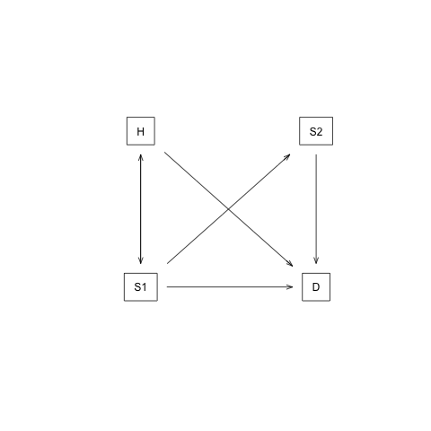

--- 
title: 'Sick-Sicker case-study using darthpack, an R package with DARTH''s decision modeling coding framework'
author: "DARTH"
date: "`r Sys.Date()`"
output: 
  pdf_document:
    includes:
      in_header: preamble.tex
description: This is a minimal description of a report of a model-based cost-effectiveness
  analysis of a health technology example of using the bookdown package to write a
  book.
documentclass: book
github-repo: DARTH-git/darthpack/report
link-citations: yes
bibliography:
- book.bib
- packages.bib
site: bookdown::bookdown_site
subtitle: Supplementary Material to "A need for change! A coding framework for improving
  transparency in decision modeling"
biblio-style: apalike
header-includes:
- \usepackage{float}
- \usepackage{setspace}\onehalfspacing
- \usepackage[margin=1in]{geometry}
---

```{r setup, include=FALSE, warning=FALSE}
# automatically create a bib database for R packages
knitr::write_bib(c(
  .packages(), 'bookdown', 'knitr', 'rmarkdown', 'dplyr', 'truncnorm', 
                           'lhs', 'IMIS', 'matrixStats',
                           'plotrix', 'psych', "survival",
                           "scatterplot3d", "reshape2",
                           "BiocManager", "devtools",
                           "shiny", "rstudioapi", 'nlme'
), 'packages.bib')
## Set path to working directory
# knitr::opts_knit$set(root.dir = '../') 
## Load packages
library(png)
if(!require(darthpack)) devtools::install_github("DARTH-git/darthpack"); library(darthpack)
# all the figures will be 6.5 x 4 inches and centered in the text.
knitr::opts_chunk$set(fig.width=6.5,
                      fig.height=4,
                      fig.align="center"
                      # fig.path="../figs/",
                      )
```

```{r Load-params, echo=FALSE}
l_params_all <- load_all_params()
```

# The Sick-Sicker model {-}
In this case-study, we perform a cost-effectiveness analysis (CEA) using a previously published 4-state model called the Sick-Sicker model [@Enns2015]. In the Sick-Sicker model, a hypothetical disease affects individuals with an average age of `r l_params_all$n_age_init` years and results in increased mortality, increased treatment costs and reduced quality of life (QoL). We simulate this hypothetical cohort of `r l_params_all$n_age_init`-year-old individuals over a lifetime (i.e., reaching an age of `r l_params_all$n_age_init + l_params_all$n_t` years old) using `r l_params_all$n_t` annual cycles, represented with `n_t`. The cohort starts in the "Healthy" health state (denoted "H"). Healthy individuals are at risk of developing the illness, at which point they would transition to the first stage of the disease (the "Sick" health state, denoted "S1"). Sick individuals are at risk of further progressing to a more severe stage (the "Sicker" health state, denoted "S2"), which is a constant probability in this case-study. There is a chance that individuals in the Sick state eventually recover and return back to the Healthy state. However, once an individual reaches the Sicker state, they cannot recover; that is, the probability of transitioning to the Sick or Healthy states from the Sicker state is zero. Individuals in the Healthy state face background mortality that is age-specific (i.e., time-dependent). Sick and Sicker individuals face an increased mortality expressed as a hazard rate ratio (HR) of 3 and 10, respectively, on the background mortality rate. Sick and Sicker individuals also experience increased health care costs and reduced QoL compared to healthy individuals. Once simulated individuals die, they transition to the "Dead" state (denoted "D"), where they remain. Figure \@ref(fig:STM-Sick-Sicker) shows the state-transition diagram of the Sick-Sicker model. The evolution of the cohort is simulated in one-year discrete-time cycles. Both costs and quality-adjusted life years (QALYs) are discounted at an annual rate of `r l_params_all$d_c`%. 

```{r STM-Sick-Sicker, echo=FALSE, fig.cap= "State-transition diagram of the Sick-Sicker model. Healthy individuals can get Sick, die or stay healthy. Sick individuals can recover, transitioning back to healthy, can die, or stay sick. Once individuals are Sicker, they stay Sicker until they die.", fig.width=6.5, fig.height=4, fig.align="center"}

```

Two alternative strategies exist for this hypothetical disease: a no-treatment and a treatment strategy. Under the treatment strategy, Sick and Sicker individuals receive treatment and continue doing so until they recover or die. The cost of the treatment is additional to the cost of being Sick or Sicker for one year. The treatment improves QoL for those individuals who are Sick but has no effect on the QoL of those who are sicker. To evaluate these two alternative strategies, we perform a CEA.

We assume that most of the parameters of the Sick-Sicker model and their uncertainty have been previously estimated and are known to the analyst. However, while we can identify those who are afflicted with the illness through obvious symptoms, we can not easily distinguish those in the Sick state from the those in the Sicker state. Thus, we can not directly estimate state-specific mortality hazard rate ratios, nor do we know the transition probability of progressing from Sick to Sicker. Therefore, we calibrate the model to different epidemiological data. We internally validated the calibrated model by comparing the predicted outputs from the model evaluated at the calibrated parameters against the calibration targets [@Eddy2012, @Goldhaber_Fiebert2010]. 

As part of the CEA, we conducted different deterministic sensitivity analysis (SA), including one-way and two-way SA, and tornado plots. To quantify the effect of parameter uncertainty on decision uncertainty, we conducted a probabilistic sensitivity analysis (PSA) and reported our uncertainty analysis results with a cost-effectiveness acceptability curve (CEAC), cost-effectiveness acceptability frontier (CEAF) and expected loss curves (ELC) [@Alarid-Escudero2019]. We also conducted a value of information (VOI) analysis to determine whether potential future research is needed to reduce parameter uncertainty. All steps of the CEA will be described using the different components of the framework. 

## Set-up {-}
This report is a supplementary material meant to guide you through the `R` code of a fully functional decision model to showcase the framework described by the [Decision Analysis in R for Technologies in Health (DARTH) workgroup](http://darthworkgroup.com/) in the manuscript *A need for change! A coding framework for improving transparency in decision modeling*. The code of this analysis can be downloaded from `darthpack` GitHub repository (https://github.com/DARTH-git/darthpack). We recommend downloading the case-study files as a single .zip file containing all directories. Unzip the folder and save to your desired directory. The framework is divided into different directories, described in Table 1, that could be accessed from the RStudio project *darthpack.Rproj*. In this framework, you will find multiple directories as described in Table 1 of the main manuscript. We refer to the directory names of this framework and scripts stored in these directories using *italic* style. This report is created with Markdown and is located in the *reports* directory of the framework. The figures for the case-study can be found in the *figs* directory, data required to conduct some of the analyses of the different components are in the *data* directory and the `R` scripts with functions, are located in the *R* directory. The main `R` scripts that conduct the analyses of the different components of the framework are stored in the `R` directory. In this document we do not show all the `R` code we refer to. Therefore, it is important to follow along while reading this document.