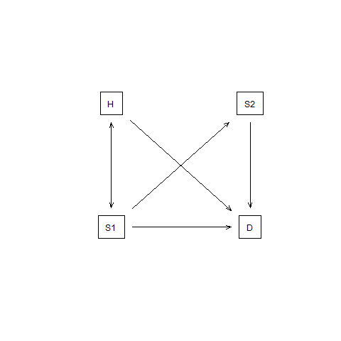
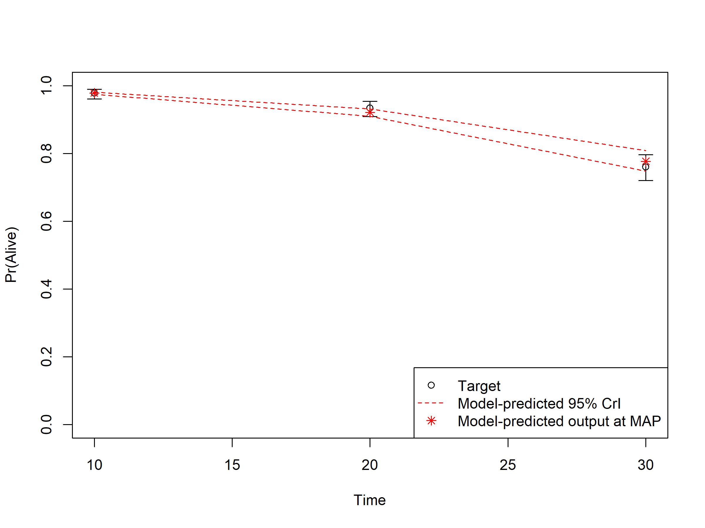

--- 
title: 'darthpack: An R package with DARTH''s decision modeling coding framework'
author: "DARTH"
date: "`r Sys.Date()`"
output: 
  pdf_document:
    includes:
      in_header: preamble.tex
description: This is a minimal description of a report of a model-based cost-effectiveness
  analysis of a health technology example of using the bookdown package to write a
  book.
documentclass: book
github-repo: DARTH-git/darthpack/report
link-citations: yes
bibliography:
- book.bib
- packages.bib
site: bookdown::bookdown_site
subtitle: Supplementary Material to "A need for change! A coding framework for improving
  transparency in decision modeling"
biblio-style: apalike
header-includes:
- \usepackage{float}
- \usepackage{setspace}\onehalfspacing
- \usepackage[margin=1in]{geometry}
---

```{r setup, include=FALSE, warning=FALSE}
# automatically create a bib database for R packages
knitr::write_bib(c(
  .packages(), 'bookdown', 'knitr', 'rmarkdown', 'dplyr', 'truncnorm', 
                           'lhs', 'IMIS', 'matrixStats',
                           'plotrix', 'psych', "survival",
                           "scatterplot3d", "reshape2",
                           "BiocManager", "devtools",
                           "shiny", "rstudioapi", 'nlme'
), 'packages.bib')
## Set path to working directory
# knitr::opts_knit$set(root.dir = '../') 
## Load packages
library(png)
if(!require(darthpack)) devtools::install_github("DARTH-git/darthpack"); library(darthpack)
# all the figures will be 6.5 x 4 inches and centered in the text.
knitr::opts_chunk$set(fig.width=6.5,
                      fig.height=4,
                      fig.align="center"
                      # fig.path="../figs/",
                      )
```

```{r Load-params, echo=FALSE}
l_params_all <- load_all_params()
```

# The Sick-Sicker model {-}
In this case-study, we perform a cost-effectiveness analysis (CEA) using a previously published 4-state model called the Sick-Sicker model [@Enns2015]. In the Sick-Sicker model, a hypothetical disease affects individuals with an average age of `r l_params_all$n_age_init` years and results in increased mortality, increased treatment costs and reduced quality of life (QoL). We simulate this hypothetical cohort of `r l_params_all$n_age_init`-year-old individuals over a lifetime (i.e., reaching an age of `r l_params_all$n_age_init + l_params_all$n_t` years old) using `r l_params_all$n_t` annual cycles, represented with `n_t`. The cohort starts in the "Healthy" health state (denoted "H"). Healthy individuals are at risk of developing the illness, at which point they would transition to the first stage of the disease (the "Sick" health state, denoted "S1"). Sick individuals are at risk of further progressing to a more severe stage (the "Sicker" health state, denoted "S2"), which is a constant probability in this case-study. There is a chance that individuals in the Sick state eventually recover and return back to the Healthy state. However, once an individual reaches the Sicker state, they cannot recover; that is, the probability of transitioning to the Sick or Healthy states from the Sicker state is zero. Individuals in the Healthy state face background mortality that is age-specific (i.e., time-dependent). Sick and Sicker individuals face an increased mortality expressed as a hazard rate ratio (HR) of 3 and 10, respectively, on the background mortality rate. Sick and Sicker individuals also experience increased health care costs and reduced QoL compared to healthy individuals. Once simulated individuals die, they transition to the "Dead" state (denoted "D"), where they remain. Figure \@ref(fig:STM-Sick-Sicker) shows the state-transition diagram of the Sick-Sicker model. The evolution of the cohort is simulated in one-year discrete-time cycles. Both costs and quality-adjusted life years (QALYs) are discounted at an annual rate of `r l_params_all$d_c`%. 

```{r STM-Sick-Sicker, echo=FALSE, fig.cap= "State-transition diagram of the Sick-Sicker model. Healthy individuals can get Sick, die or stay healthy. Sick individuals can recover, transitioning back to healthy, can die, or stay sick. Once individuals are Sicker, they stay Sicker until they die.", fig.width=6.5, fig.height=4, fig.align="center"}

```

Two alternative strategies exist for this hypothetical disease: a no-treatment and a treatment strategy. Under the treatment strategy, Sick and Sicker individuals receive treatment and continue doing so until they recover or die. The cost of the treatment is additional to the cost of being Sick or Sicker for one year. The treatment improves QoL for those individuals who are Sick but has no effect on the QoL of those who are sicker. To evaluate these two alternative strategies, we perform a CEA.

We assume that most of the parameters of the Sick-Sicker model and their uncertainty have been previously estimated and are known to the analyst. However, while we can identify those who are afflicted with the illness through obvious symptoms, we can not easily distinguish those in the Sick state from the those in the Sicker state. Thus, we can not directly estimate state-specific mortality hazard rate ratios, nor do we know the transition probability of progressing from Sick to Sicker. Therefore, we calibrate the model to different epidemiological data. We internally validated the calibrated model by comparing the predicted outputs from the model evaluated at the calibrated parameters against the calibration targets [@Eddy2012, @Goldhaber_Fiebert2010]. 

As part of the CEA, we conducted different deterministic sensitivity analysis (SA), including one-way and two-way SA, and tornado plots. To quantify the effect of parameter uncertainty on decision uncertainty, we conducted a probabilistic sensitivity analysis (PSA) and reported our uncertainty analysis results with a cost-effectiveness acceptability curve (CEAC), cost-effectiveness acceptability frontier (CEAF) and expected loss curves (ELC) [@Alarid-Escudero2019]. We also conducted a value of information (VOI) analysis to determine whether potential future research is needed to reduce parameter uncertainty. All steps of the CEA will be described using the different components of the framework. 

## Set-up {-}
This report is a supplementary material meant to guide you through the `R` code of a fully functional decision model to showcase the framework described by the [Decision Analysis in R for Technologies in Health (DARTH) workgroup](http://darthworkgroup.com/) in the manuscript *A need for change! A coding framework for improving transparency in decision modeling*. The code of this analysis can be downloaded from GitHub (https://github.com/DARTH-git/Decision-Modeling-Framework). We recommend downloading the case-study files as a single .zip file containing all directories. Unzip the folder and save to your desired directory. The framework is divided into different directories, described in Table 1, that could be accessed from the RStudio project *Decision-Modeling-Framework.Rproj*. In this framework, you will find multiple directories as described in Table 1 of the main manuscript. We refer to the directory names of this framework and scripts stored in these directories using *italic* style. This report is created with Markdown and is located in the *reports* directory of the framework. The figures for the case-study can be found in the *figs* directory, data required to conduct some of the analyses of the different components are in the *data* directory and the `R` scripts with functions, are located in the *R* directory. The main `R` scripts that conduct the analyses of the different components of the framework are stored in the `R` directory. In this document we do not show all the `R` code we refer to. Therefore, it is important to follow along while reading this document.

<!--chapter:end:index.Rmd-->

```{r, include = FALSE, warning = FALSE}
# all the figures will be 6.5 x 4 inches and centered in the text.
knitr::opts_chunk$set(fig.width=6.5, 
                      fig.height=4, 
                      fig.align="center"
                      # fig.path="../figs/", 
                      )
## Set path to working directory
# knitr::opts_knit$set(root.dir = '../') 
# load packages
library(darthpack)
l_params_all <- load_all_params()
```

# Define model inputs {#inputs}

As described in the main manuscript, in this first component we declare all model input variables and set their values. The `R` script running the analysis of this component is the *01_model-inputs.R* file in the `analysis` directory. 

The input to inform the values is divided in three categories: external, estimated, and calibrated. The majority of the Sick-Sicker model parameters are informed by external data. Only three parameter values need to be estimated using model calibration. 

In this component, we start with the general setup of the model, specifying among others the time horizon, name and number of health states, proportion of the cohort in each of the different health states at the start of the simulation and discount rates. The next step is to specify the external parameters. The initial model parameter values and `R` variable names are presented in Table \@ref(tab:parameters). 

Table: (\#tab:parameters) Description of the initial parameters with their `R` name and value of the Sick-Sicker model.

|           **Parameter**            |  **R name** |   **Value**   |
|:-----------------------------------|:------------|:--------------|
| Time horizon ($n_t$)               | `n_t`       | `r l_params_all$n_t` years |
| Names of health states ($n$)       | `v_n`       | H, S1, S2, D  |
| Annual discount rate (costs/QALYs) | `d_c`/`d_e` |  3%           |
| Annual transition probabilities    |             |               |
| - Disease onset (H to S1)          | `p_HS1`     |  `r l_params_all$p_HS1`         |
| - Recovery (S1 to H)               | `p_S1H`     |  `r l_params_all$p_S1H`          |
| - Disease progression (S1 to S2)  in the time-homogenous model   | `p_S1S2`    |  `r l_params_all$p_S1S2`        |
| Annual mortality                   |             |               |
| - All-cause mortality (H to D)     | `p_HD`      |  age-specific |
| - Hazard rate ratio of death in S1 vs H | `hr_S1`     |  `r l_params_all$hr_S1`            |
| - Hazard rate ratio of death in S2 vs H | `hr_S2`     |  `r l_params_all$hr_S1`           |
| Annual costs                       |             |               |
| - Healthy individuals              | `c_H`       |  $2,000       |
| - Sick individuals in S1           | `c_S1`      |  $4,000       |
| - Sick individuals in S2           | `c_S2`      |  $15,000      |
| - Dead individuals                 | `c_D`       |  $0           |
| - Additional costs of sick individuals treated in S1 or S2           | `c_Trt`     |  $12,000      |
| Utility weights                    |             |               |
| - Healthy individuals              | `u_H`       |  1.00         |
| - Sick individuals in S1           | `u_S1`      |  0.75         |
| - Sick individuals in S2           | `u_S2`      |  0.50         |
| - Dead individuals                 | `u_D`       |  0.00         |
| Intervention effect                |             |               |
| - Utility for treated individuals in S1 | `u_Trt` |  0.95        |

Age-specific background mortality for healthy individuals is represented by the US population in 2015 and obtained from the [Human Mortality database](https://www.mortality.org). This information is stored in the *01_all-cause-mortality.csv* file in the *data* directory. Based on this .csv file a vector with mortality rates by age is created using the `load_mort_data` function in the *01_model-inputs_functions.R* script. This function gives us the flexibility to easily import data from other countries or years. 

```{r}
print.function(load_mort_data) # print the function
``` 

Another function in the *01_model-inputs_functions.R* script, is the `load_all_parms` function. This function, which is actually using the `load_mort_data` function, loads all parameters for the decision model from multiple sources and creates a list that contains all parameters and their values. 
```{r}
print.function(load_all_params)  # print the function
``` 

The `load_all_params` function is informed by the arguments `file.init` and `file.mort`. The `file.init` argument is a string with the location and name of the file with initial set of parameters. The initial parameter values for our case-study are stored in the *01_init-params.csv* file located in the *data* directory. The `load_all_params` function read this .csv file into the function environment as a dataframe called, `df_params_init`.  

The `file.mort` argument is a string with the location and name of the file with mortality data. As described before, in our case-study this is the *01_all-cause-mortality.csv* file. Within the `load_all_parms` function, the `load_mort_data` function is used to create a vector with mortality rates from the .csv data. 

After loading all the information, the `load_all_params` generates a list called, `l_params_all`, including all parameters for the model including the general setup parameters and the vector of mortality rates. The function also stores the dataframe  `df_params_init` with the initial set of parameters in the list. This is all executed in the in the *01_model-inputs.R* script by running the code below. 
```{r, eval = FALSE, echo = TRUE}
l_params_all <- load_all_params()
```
For the Sick-Sicker model we do not have to estimate parameters, but we do have three parameters that need to be estimated via model calibration. In this stage of the framework, we simply set these parameters to valid “dummy” values that are compatible with the next phase of the analysis, model implementation, but are ultimately just placeholder values until we conduct the calibration phase. This means that these values will be replaced by the best-fitted calibrated values after we performed the calibration in component 3. 

Using a function to create a list of base-case parameters to have all model parameters in a single object is very useful, because this object will have to be updated for the calibration and the different sensitivity analyses in components 3 and 5 of the framework, respectively. Below, we guide you through the components of the function. 

<!--chapter:end:01-inputs.Rmd-->

```{r, include = FALSE, warning = FALSE}
library(reshape2)
library(ggplot2)
library(darthpack)
### Load parameters
l_params_all <- load_all_params()
```

# Decision model {#simulation}

In this second component, we build the backbone of the decision analysis: the implementation of the model. This component is performed by the *02_simulation_model.R* script. This file itself is not very large. It simply loads some packages and sources the input from component 01 and in addition it runs the `decision_model` function that is used to caputre the dynamic process of the Sick-Sicker example and stores the output. The output of the model is the traditional cohort trace. The trace describes how the cohort is distributed among the different health states over time and is plotted at the end of this script.

The function `decision_model` is defined in the *02_simulation_model_functions.R* file in the `R` folder. As described in the paper, constructing a model as a function at this stage facilitates subsequent stages of the model development and analysis. This since these processes will all call the same model function, but pass different parameter values and/or calculate different final outcomes based on the model outputs. In the next part, we will describe the code within the function.

```{r}
print.function(decision_model) # print the code of the function
```

The `decision_model` function is informed by the argument `l_params_all`. Via this argument we give the function a list with all parameters of the decision model. For the Sick-Sicker model, these parameters are stored in the list `l_params_all`, which we passed into the function as shown below. 

```{r, eval = TRUE, echo = TRUE}
l_out_stm <- decision_model(l_params_all = l_params_all) # run the function
```

This function itself has all the mathematical equations of the decision models coded inside. It starts by calculating the age-specific transition probabilities from all non-dead states based on the vector of age-specific mortality rates `v_r_mort_by_age`. These parameters will become vectors of length `n_t`, describing the probability to die for all ages from all non-dead states. 

The next part of the function, creates an array that stores age-specific transition probability matrices in each of the third dimension. The transition probability matrix is a core component of a state-transition cohort model [@Iskandar2018]. This matrix contains the probabilities of transitioning from the current health state, indicated by the rows, to the other health states, specified by the columns. Since we have age-specific transition probabilities, the transition probability matrix is different each cycle. These probabilities are only depending on the age of the cohort, and not on other events; therefore, we can generate all matrices at the start of the model. This results in `n_t` different age-specific matrices that are stored in an array, called `a_P`, of dimensions `n_states` x `n_states` x `n_t`. After initializing the array, it is filled with the transition probability stored in the list. When running the model, we can index the correct transition probability matrix corresponding with the current age of the cohort. We then added some sanity checks to make sure that the transition matrices and the transition probabilities are valid. The first three and last cycles of the transition probability matrices stored in the array `a.P` are shown below. 

```{r, echo = TRUE, eval = TRUE}
l_out_stm$a_P[, , 1:3] # show the first three time-points of a_P
l_out_stm$a_P[, , l_params_all$n_t] # show it for the last cycle
```
By comparing these probability matrices, we observe an increase in the probabilities of transitioning to death from all health states. 

After the array is filled, the cohort trace matrix, `m_M`, of dimensions `n_t` x `n_states` is initialized. This matrix will store the state occupation at each point in time. The first row of the matrix is informed by the initial state vector `v_s_init`. For the remaining points in time, we iteratively multiply the cohort trace with the age-specific transition probability matrix corresponding to the specific cycle obtained by indexing the array `a_P` appropriately. All the outputs and relevant elements of the decision model are stored in a list, called `l_out_stm`. This list contains the array of the transition probability matrix for all cycles `t` and the cohort trace `m_M`. 

```{r, eval = TRUE, echo = TRUE}
head(l_out_stm$m_M)    # show the top part of the cohort trace
tail(l_out_stm$m_M)    # show the bottom part of the cohort trace
```

Using the code below, we can graphically show the model dynamics by plotting the cohort trace. Figure \@ref(fig:Sick-Sicker-Trace) shows the distribution of the cohort among the different health states at each time point. 

```{r Sick-Sicker-Trace, echo = FALSE, fig.cap = 'Cohort trace of the Sick-Sicker cohort model', message = FALSE, warning = FALSE, fig.pos = "H"} 
ggplot(melt(l_out_stm$m_M), aes(x = Var1, y = value, color = Var2, linetype = Var2)) +
  geom_line(size = 1.3) +
  scale_color_discrete(l = 50, name = "Health state") +
  scale_linetype_discrete(name = "Health state") +
  xlab("Cycle") +
  ylab("Proportion of the cohort") +
  theme_bw(base_size = 16) +
  theme()
# matplot(m_M, pch = v.n)
```


<!--chapter:end:02-decision_model.Rmd-->

---
output:
  pdf_document: default
  html_document: default
---
```{r, include = FALSE, warning = FALSE}
library(knitr)
# https://haozhu233.github.io/kableExtra/awesome_table_in_html.html
library(kableExtra)
library(dplyr)
library(reshape2)
library(ggplot2)
library(png)
library(darthpack)
### Load parameters
l_params_all <- load_all_params()
```

# Model calibration {#calibration}

In this third component, we calibrate unknown model parameters by matching model outputs to specified calibration targets. Specifically, we calibrate the Sick-Sicker model to match survival, prevalence and the proportion who are Sicker, among all those afflicted (Sick+Sicker). We used a Bayesian calibration approach using the incremental mixture importance sampling (IMIS) algorithm [@Steele2006], which has been used to calibrate health policy models [@Raftery2010, @Menzies2017, @Rutter2018]. Bayesian methods allow us to quantify the uncertainty in the calibrated parameters even in the presence of non-identifiability [@Alarid-Escudero2018b]. This analysis is coded in the *03_calibration.R* file in the `analysis` folder. The target data is stored in the *03_calibration_targets.RData* file. Similar to component 02 \@ref(simulation), in the section _03.1 Load packages_, we start by loading inputs and functions. In addition, we load the calibration targets data into the R workspace. In the next section, _03.2 Visualize targets_, we plot each of the calibration targets with their confidence intervals.

In section _03.3 Run calibration algorithms_, we set the parameters we need to calibrate to fixed values and test if the function `calibration_out` that produces model outputs corresponding to the calibration targets works. This function takes a vector of parameters that need to be calibrated and a list with all parameters of decision model and computes model outputs to be used for calibration routines.

```{r}
print.function(calibration_out) # print the functions
```

This function is informed by two argument `v_params_calib` and `l_params_all`. The vector `v_params_calib` contains the values of the three parameters of interest. The list `l_params_all` contains all parameters of the decision model. The placeholder values are replaced by `v_params_calib` and with these values the model is evaluated. Model evaluation takes place by running the `decision_model` function, described in component 02. The result in a new list with output of the model corresponding to the parameter values in the `v_params_calib`. With this new decision model output, the overall survival, disease prevalence and the proportion of Sicker in the Sick and Sicker states are calculated. The estimated values for these epidemiological outcomes at different timepoints are combined in a list called `l_out` produced but the `calibration_out`. 

Once we make sure this code works, we specify the calibration parameters in section _03.3.1 Specify calibration parameters_. These include setting the seed for the random number generation, specifying the number of random samples to obtain from the calibrated posterior distribution, the name of the input parameters and the range of these parameters that will inform the prior distributions of the calibrated parameters, and the name of the calibration targets: `Surv`, `Prev`, `PropSick`.

In the next section, _03.3.2 Run IMIS algorithm_, we calibrate the Sick-Sicker model with the IMIS algorithm. For this case-study, we assume a normal likelihood and uniform priors. For a more detailed description of IMIS for Bayesian calibration, different likelihood functions and prior distributions, we refer the reader to the tutorial for Bayesian calibration by Menzies et al. [@Menzies2017]. We use the `IMIS` function from the `IMIS` package that calls the functions `likelihood`, `sample.prior` and `prior`, to draw samples from the posterior distribution [@IMIS]. The functions are specified in the *03_calibration_functions.R* file in the `R` folder. For the `IMIS` function, we specify the incremental sample size at each iteration of IMIS, the desired posterior sample size at the resample stage, the maximum number of iterations in IMIS and the number of optimizers which could be 0. The function returns a list, which we call `l_fit_imis`, with the posterior samples, the diagnostic statistics at each IMIS iteration and the centers of Gaussian components [@IMIS]. We store the posterior samples in the matrix `m_calib_post`. 

We then explore these posterior distributions in section _03.4 Exploring posterior distribution_. We start by estimating the posterior mean, median and 95% credible interval, the mode and the maximum-a-posteriori (MAP). All for these summary statistics are combined in a dataframe called `df_posterior_summ`. Table \@ref(tab:SummaryCal) shows the summary statistics of the posterior distribution. 
```{r SummaryCal, eval = TRUE, echo = FALSE, message=F, warning=F, cache=F}
load("../tables/03_summary_posterior.RData")
knitr::kable(df_posterior_summ[, -1], caption = "Summary statistics of the posterior distribution", format = "latex") # create a table 
``` 

In section _03.4.2 Visualization of posterior distribution_, we generate a pairwise scatter plot of the calibrated parameters (Figure \@ref(fig:03-posterior-distribution-marginal)) and a 3D scatter plot of the joint posterior distribution (Figure \@ref(fig:Posterior-distribution-joint)). These figures are saved in the *figs* directory.

```{r Posterior-distribution-joint, out.width='100%', fig.cap='Joint posterior distribution', echo=FALSE}
knitr::opts_knit$set(root.dir = '..')

```


```{r 03-posterior-distribution-marginal, fig.cap="Pairwise posterior distribution of calibrated parameters", out.width='100%', echo = FALSE}
knitr::include_graphics("../figs/03_posterior_distribution_marginal.png")
```

Finally, the posterior distribution and MAP estimate from the IMIS calibration are stored in the file *03_imis_output.RData*. Storing this data as an .Rdata file allows to import the data in following sections without needing to re-run the calibration component. 

<!--chapter:end:03-calibration.Rmd-->


```{r, include = FALSE, warning = FALSE}
library(knitr)
# https://haozhu233.github.io/kableExtra/awesome_table_in_html.html
library(kableExtra)
library(dplyr)
library(reshape2)
library(ggplot2)
library(darthpack)
```

# Validation  {#validation}

In this forth component, we check the internal validity of our Sick-Sicker model before we move on to the analysis components. To internally validate the Sick-Sicker model, we compare the model-predicted output evaluated at posterior parameters against the calibration targets. This is all done in the *04_validation.R* script in the `analysis` folder. 

In section _04.2 Compute model-predicted outputs_, we compute the model-predicted outputs for each sample of posterior distribution as well as for the MAP estimate. We then use the function `data_summary` to summarize the model-predicted posterior outputs into different summary statistics. 
```{r}
print.function(data_summary)
```
This function is informed by three arguments, `data`, `varname` and `groupnames`.

The computation of the model-predicted outputs using the MAP estimate is done by inserting the `v_calib_post_map` data into the previously described `calibration_out` function. This function creates a list including the estimated values for survival, prevalence and the proportion of sicker individuals at cycles 10, 20 and 30. 

In sections _04.6 Internal validation: Model-predicted outputs vs. targets_, we check the internal validation by plotting the model-predicted outputs against the calibration targets (Figures \@ref(fig:04-surv)-\@ref(fig:04-proportion)). The generated plots are saved as .png files in the *fig* folder. These files can be used in reports without the need of re-running the code. 

```{r 04-surv, fig.cap="Survival data: Model-predicted outputs vs targets.", out.width='100%', echo = FALSE }

```

```{r 04-prevalence, fig.cap = "Prevalence data of sick individuals: Model-predicted output vs targets.",out.width='100%', echo=FALSE}
knitr::include_graphics("../figs/04_posterior_vs_targets_prevalence.png")
```

```{r 04-proportion, fig.cap="Proportion who are Sicker, among all those afflicted (Sick + Sicker): Model-predicted output.", out.width='100%', echo = FALSE}
knitr::include_graphics("../figs/04_posterior_vs_targets_proportion_sicker.png")
```


<!--chapter:end:04-validation.Rmd-->

<<<<<<< HEAD
```{r, include = FALSE, warning = FALSE}
library(knitr)
# https://haozhu233.github.io/kableExtra/awesome_table_in_html.html
library(kableExtra)
library(dplyr)
library(reshape2)
library(ggplot2)
library(scales)   # for dollar signs and commas
library(dampack)
library(darthpack)
### Load parameters
l_params_all <- load_all_params()
```

# Analysis {#analysis}
The analysis component is where the elements in components 1-4 are combined to answer the question(s) of interest given current information and to quantify the value of potential further research. Our framework separates the analysis in three subcomponents: _05a Deterministic analysis_, _05b Uncertainty analysis_ and _05c Value of information analysis_. For the Sick-Sicker case-study, we use all three subcomponents to conduct the CEA and to quantify the uncertainty of our decision. For procedures in the CEA, we rely on the `R` package `dampack`, which is available here: <https://github.com/DARTH-git/dampack>. Instructions for installing `dampack` are described in Appendix 0 provided in the *app0_packages_setup.R* script of the *analysis* folder.

## 05a Deterministic analysis {#Deterministic-analysis}
In this subcomponent, we perform a deterministic CEA, followed by some deterministic sensitivity analysis, including one-way, two-way and tornado sensitivity analyses. The function script of this subcomponent, *05a_deterministic_analysis_function.R*, contains the function `calculate_ce_out`. This function calculates costs and effects for a given vector of parameters using a simulation model. We need to run our simulation model using the calibrated parameter values, but the list we created in component 01 \@ref(inputs) still contain the placeholder values for the calibrated parameters. This means we need to update these values by the calibrated values stored in the vector `v_calib_post_map`. The function `update_param_list` updates the list of parameters with new values for some specific parameters. 

```{r}
print.function(update_param_list)
``` 

The first argument of the function, called `l_params_all`, is a list with all the parameters of decision model. The second argument, `params_updated`, is an object with parameters for which values need to be updated. The function returns the list `l_params_all` with updated values. 

In the *05a_deterministic_analysis.R* script we execute the `update_param_list` function for our case-study, resulting in the list `l_params_basecase` where the placeholder values for `p_S1S2`, `hr_S1` and `hr_S2` are replaced by the calibration estimates. 

```{r, eval = TRUE, echo = TRUE}
l_params_basecase <- update_param_list(l_params_all, v_calib_post_map) 
```
We use this new list as an argument in the `calculate_ce_out` function. In addition, we specify the willingness-to-pay (WTP) threshold value using the `n_wtp` argument of this function. This WTP value is used to compute a net monetary benefit (NMB) value. If the user does not specify the WTP, a default value of $100,000/QALY will be used by the function. 

```{r}
df_out_ce <- calculate_ce_out(l_params_all = l_params_basecase, 
                                n_wtp = 150000)
print.function(calculate_ce_out) # print the function
```

After calculating the discount weights, this function runs the simulation model using the previously described function `decision_model` in the *02_simulatiomn_model_function.R* script. Inside the function `calculate_ce_out`, the simulation model is run for both the treatment,  `l_model_out_trt`, and no treatment, `l_model_out_no_trt`, strategies of the Sick-Sicker model. Running it for both treatment strategies is done for illustration purposes. In this case-study, the resulting cohort traces are identical and we could have executed it only once. 

In the second part of the function we create multiple vectors for both the cost and effects of both strategies. These vectors multiply the cohort trace to compute the cycle-specific rewards. This results in vectors of total costs (`v_tc`) and total effects (`v_tu`) per cycle. By multiplying these vectors with the vectors with the discount weights for costs (`v_dwc`) and effects (`v_dwe`) we get the total discounted mean costs (`tc_d_no_trt` and `tc_d_trt`) and QALYs (`tu_d_no_trt` and `tu_d_trt`) for both strategies. These values are used in the calculation of the NMB. Finally, the total discounted costs, effectiveness and NMB are combined in the dataframe `df_ce`. The results for our case-study are shown below. 

```{r, eval = TRUE, echo = TRUE}
df_out_ce # print the dataframe 
```

This dataframe of CE results can be used as an argument in the `calculate_icers` function from the `dampack` package to calculate the incremental cost-effectiveness ratios (ICERs) and noting which strategies are weakly and strongly dominated. Table \@ref(tab:df-cea-det) shows the result of the deterministic CEA. 

```{r, eval = TRUE, echo = TRUE}
df_cea_det <- calculate_icers(cost = df_out_ce$Cost, 
                              effect = df_out_ce$Effect, 
                              strategies = l_params_basecase$v_names_str)
```

```{r df-cea-det, eval = TRUE, echo = FALSE}
# load("../tables/05a_deterministic_cea_results.RData")
knitr::kable(df_cea_det[, -7], caption = "Deterministic cost-effectiveness analysis results of the Sick-Sicker model comparing no treatment with treatment.") # create a table 
``` 

Finally, Figure  \@ref(fig:05a-CEA-frontier) shows the cost-effectiveness frontier of the CEA.

```{r 05a-CEA-frontier, fig.cap="Cost-effectiveness frontier.", out.width='100%', echo=FALSE}
knitr::include_graphics("../figs/05a_cea_frontier.png")
```

We then conduct a series of deterministic sensitivity analysis. First, we conduct a one-way sensitivity analysis (OWSA) on the variables `c_Trt`, `p_HS1`, `u_S1` and `u_Trt` and a two-way sensitivity analysis (TWSA) using the owsa_det and twsa_det functions. We use the output of these functions to produce different SA plots, such as OWSA tornado, one-way optimal strategy and TWSA plots (Figures \@ref(fig:05a-owsa-nmb) - \@ref(fig:05a-twsa-uS1-uTrt-nmb)).

```{r 05a-owsa-nmb, fig.cap = "One-way sensitivity analysis results", out.width='100%', echo = FALSE}
knitr::include_graphics("../figs/05a_owsa_nmb.png")
```

```{r 05a-optimal-owsa-nmb, fig.cap = "The optimal strategy with OWSA", out.width='100%', echo=FALSE}
knitr::include_graphics("../figs/05a_optimal_owsa_nmb.png")
```

```{r 05a-tornado-Treatment-nmb, fig.cap = "The tornado plot", out.width='100%', echo=FALSE}
knitr::include_graphics("../figs/05a_tornado_Treatment_nmb.png")
```

```{r 05a-twsa-uS1-uTrt-nmb, fig.cap = "Two-way sensitivity results.", out.width='100%', echo=FALSE}
knitr::include_graphics("../figs/05a_twsa_uS1_uTrt_nmb.png")
```


## 05b Probabilistic analysis {#Probabilistic-analysis} 
In this subcomponent, we evaluate decision uncertainty by propagating the uncertainty through the CEA using probabilistic sensitivity analysis (PSA). Until now we used the parameter values as described in Table \@ref(tab:parameters). However, we are uncertain about these values. Most of these input parameters are defined by probability distribution as described in Table \@ref(tab:parameters-PSA). 

Table: (\#tab:parameters-PSA) Description of parameters with their R name and distribution.

  |           **Parameter**         |  **R name** |   **Distribution**    |
  |:--------------------------------|:------------|:---------------------------------------------|
  | Annual transition probabilities |             |                       |
  | - Disease onset (H to S1)       | `p_HS1`     |  `beta(30, 170)`        |
  | - Recovery (S1 to H)            | `p_S1H`     |  `beta(60, 60)`         |
  | Annual costs                    |             |               |
  | - Healthy individuals           | `c_H`       |  `gamma(shape = 100, scale = 20)`        |
  | - Sick individuals in S1        | `c_S1`      |  `gamma(shape = 177.8, scale = 22.5)`       |
  | - Sick individuals in S2        | `c_S2`      |  `gamma(shape = 225, scale = 66.7)`     |
  | - Additional costs of sick individuals treated in S1 or S2           | `c.Trt`     |  `gamma(shape = 73.5, scale = 163.3)`      |
  | Utility weights                 |             |               |
  | - Healthy individuals           | `u_H`       |`truncnorm(mean = 1, sd = 0.01, b = 1)`         |
  | - Sick individuals in S1        | `u_S1`      |`truncnorm(mean = 0.75, sd = 0.02, b = 1)`         |
  | - Sick individuals in S2        | `u_S2`      |`truncnorm(mean = 0.50, sd = 0.03, b = 1)`         |
  | Intervention effect             |             |               |
  | - Utility for treated individuals in S1 | `u_Trt` |`truncnorm(mean = 0.95, sd = 0.02, b = 1)`        |
  
In a PSA we sample the input parameter values from these distributions and we then run the model at each sample. In the file *05b_uncertainty_analysis_functions.R* we created a single function, called `generate_psa_params`. This function generates a PSA dataset for all the CEA input parameters. We specify the number of PSA samples via the `n_sim` argument. The function also accepts specifying a seed to allow reproducibility of the results.

```{r, eval = TRUE, echo = TRUE}
print.function(generate_psa_params) # print the function 
```

The function returns the `df_psa_input` dataframe with a PSA dataset of the input parameters. With this dataframe we can run the PSA to produce distributions of costs, effectiveness and NMB. The PSA is performed by the  *05b_probabilistic_analysis.R* script. As shown in the code below, the `df_psa_input` dataframe is used by the `update_param_list` function to generate the corresponding list of parameters for the PSA. For each simulation, we perfrom three steps. First, the list of parameters is updated by the `update_param_list` function. Second, the model is executed by the `calculate_ce_out` function using the updated parameter list and third, the dataframes `df_c` and `df_e` store the estimated cost and effects, respectively. The final part of this loop is to satisfy the modeler when waiting on the results, by displaying the simulation progress.  

```{r, eval = FALSE, echo = TRUE}
for(i in 1:n_sim){ 
  l_psa_input <- update_param_list(l_params_all, df_psa_input[i, ])
  df_out_temp <- calculate_ce_out(l_psa_input)
  df_c[i, ] <- df_out_temp$Cost
  df_e[i, ] <- df_out_temp$Effect
  # Display simulation progress
  if(i/(n_sim/10) == round(i/(n_sim/10), 0)) {
    cat('\r', paste(i/n_sim * 100, "% done", sep = " "))
  }
}
``` 

We can plot the results using the `plot` function from `dampack`. Figure \@ref(fig:05b-CEAplane) shows the CE scatter plot with the joint distribution of costs and effects for each strategy and their corresponding 95% confidence ellipse. 

```{r 05b-CEAplane, out.width='100%', fig.cap="The cost-effectiveness plane graph showing the results of the probabilistic sensitivity analysis for the Sick-Sicker case-study.", echo=FALSE}
knitr::include_graphics("../figs/05b_cea_plane_scatter.png")
```

```{r df-cea-prob, eval = TRUE, echo = FALSE}
df_cea_psa <- read.csv(file = "./tables/05b_probabilistic_cea_results.csv")[, c(-1, -8)]
# load("../tables/05b_probabilistic_cea_results.RData")
knitr::kable(df_cea_psa[, -7], caption = "Probabilistic cost-effectiveness analysis results of the Sick-Sicker model comparing no treatment with treatment", format = "latex") # create a table 
``` 
Next, we perform a CEA using the previously used `calculate_icers` functions from `dampack`. Table \@ref(tab:df-cea-prob) shows the results of the probabilistic CEA. In addition, we plot a cost-effectiveness plane with the frontier, the cost-effectiveness acceptability curves (CEACs) and frontier (CEAF), expected Loss curves (ELCs) (Figure \@ref(fig:05b_cea_frontier_psa) - \@ref(fig:05b-elc)) [@Alarid-Escudero2019]. Followed by creating linear regression metamodeling sensitivity analysis graphs (Figure \@ref(fig:05b-owsa-lrm-nmb) - \@ref(fig:05b-twsa-lrm-uS1-uTrt_nmb))[@Jalal2013]. All generated figures are shown below and stored to the *figs* folder . 

```{r 05b-cea-frontier-psa, out.width='100%', fig.cap = "Cost-effectiveness frontier", echo = FALSE }
knitr::opts_knit$set(root.dir = '..')
knitr::include_graphics("../figs/05b_cea_frontier_psa.png")
```

```{r 05b-ceac-ceaf, out.width='100%', fig.cap= "Cost-effectiveness acceptability curves (CEACs) and frontier (CEAF).", echo = FALSE}
knitr::opts_knit$set(root.dir = '..')
knitr::include_graphics("../figs/05b_ceac_ceaf.png")
```

```{r 05b-elc, out.width='100%', fig.cap="Expected Loss Curves.", echo = FALSE}
knitr::opts_knit$set(root.dir = '..')
knitr::include_graphics("../figs/05b_elc.png")
```

```{r 05b-owsa-lrm-nmb, out.width='100%', fig.cap = "One-way sensitivity analysis (OWSA).", echo = FALSE}
knitr::opts_knit$set(root.dir = '..')
knitr::include_graphics("../figs/05b_owsa_lrm_nmb.png")
```

```{r 05b-optimal-owsa-lrm-nmb, out.width='100%', fig.cap = "Optimal strategy with OWSA", echo=FALSE}
knitr::opts_knit$set(root.dir = '..')
knitr::include_graphics("../figs/05b_optimal_owsa_lrm_nmb.png")
```

```{r 05b-tornado-lrm-Treatment-nmb, out.width='100%', fig.cap="Tornado plot", echo=FALSE}
knitr::opts_knit$set(root.dir = '..')
knitr::include_graphics("../figs/05b_tornado_lrm_Treatment_nmb.png")
``` 

```{r 05b-twsa-lrm-uS1-uTrt-nmb, out.width='100%', fig.cap = "Two-way sensitivity analysis (TWSA).", echo=FALSE}
knitr::opts_knit$set(root.dir = '..')
knitr::include_graphics("../figs/05b_twsa_lrm_uS1_uTrt_nmb.png")
```

## 05c Value of information {#voi}
In the VOI component, the results from the PSA generated in the probabilistic analysis subcomponent are used to determine whether further potential research is needed. We use the `calc_evpi` function from the `dampack` package to calculate the expected value of perfect information (EVPI). Figure \@ref(fig:05c-evpi) shows the EVPI for the different WTP values.

```{r, eval = FALSE, echo = TRUE}
evpi <- calc_evpi(wtp = v_wtp, psa = l_psa)
```

```{r 05c-evpi, fig.cap="Expected value of perfect information", out.width='100%', echo=FALSE}
knitr::include_graphics("../figs/05c_evpi.png")
```


=======
```{r, include = FALSE, warning = FALSE}
library(knitr)
# https://haozhu233.github.io/kableExtra/awesome_table_in_html.html
library(kableExtra)
library(dplyr)
library(reshape2)
library(ggplot2)
library(scales)   # for dollar signs and commas
library(dampack)
library(darthpack)
### Load parameters
l_params_all <- load_all_params()
```

# Analysis {#analysis}
The analysis component is where the elements in components 1-4 are combined to answer the question(s) of interest given current information and to quantify the value of potential further research. Our framework separates the analysis in three subcomponents: _05a Deterministic analysis_, _05b Uncertainty analysis_ and _05c Value of information analysis_. For the Sick-Sicker case-study, we use all three subcomponents to conduct the CEA and to quantify the uncertainty of our decision. For procedures in the CEA, we rely on the `R` package `dampack`, which is available here: <https://github.com/DARTH-git/dampack>. Instructions for installing `dampack` are described in Appendix 0 provided in the *app0_packages_setup.R* script of the *analysis* folder.

## 05a Deterministic analysis {#Deterministic-analysis}
In this subcomponent, we perform a deterministic CEA, followed by some deterministic sensitivity analysis, including one-way, two-way and tornado sensitivity analyses. The function script of this subcomponent, *05a_deterministic_analysis_function.R*, contains the function `calculate_ce_out`. This function calculates costs and effects for a given vector of parameters using a simulation model. We need to run our simulation model using the calibrated parameter values, but the list we created in component 01 (\@ref(inputs)) still contain the placeholder values for the calibrated parameters. This means we need to update these values by the calibrated values stored in the vector `v_calib_post_map`. The function `update_param_list` updates the list of parameters with new values for some specific parameters. 

```{r}
print.function(update_param_list)
``` 

The first argument of the function, called `l_params_all`, is a list with all the parameters of decision model. The second argument, `params_updated`, is an object with parameters for which values need to be updated. The function returns the list `l_params_all` with updated values. 

In the *05a_deterministic_analysis.R* script we execute the `update_param_list` function for our case-study, resulting in the list `l_params_basecase` where the placeholder values for `p_S1S2`, `hr_S1` and `hr_S2` are replaced by the calibration estimates. 

```{r, eval = TRUE, echo = TRUE}
l_params_basecase <- update_param_list(l_params_all, v_calib_post_map) 
```
We use this new list as an argument in the `calculate_ce_out` function. In addition, we specify the willingness-to-pay (WTP) threshold value using the `n_wtp` argument of this function. This WTP value is used to compute a net monetary benefit (NMB) value. If the user does not specify the WTP, a default value of $100,000/QALY will be used by the function. 

```{r}
df_out_ce <- calculate_ce_out(l_params_all = l_params_basecase, 
                                n_wtp = 150000)
print.function(calculate_ce_out) # print the function
```

After calculating the discount weights, this function runs the simulation model using the previously described function `decision_model` in the *02_simulatiomn_model_function.R* script. Inside the function `calculate_ce_out`, the simulation model is run for both the treatment,  `l_model_out_trt`, and no treatment, `l_model_out_no_trt`, strategies of the Sick-Sicker model. Running it for both treatment strategies is done for illustration purposes. In this case-study, the resulting cohort traces are identical and we could have executed it only once. 

In the second part of the function we create multiple vectors for both the cost and effects of both strategies. These vectors multiply the cohort trace to compute the cycle-specific rewards. This results in vectors of total costs (`v_tc`) and total effects (`v_tu`) per cycle. By multiplying these vectors with the vectors with the discount weights for costs (`v_dwc`) and effects (`v_dwe`) we get the total discounted mean costs (`tc_d_no_trt` and `tc_d_trt`) and QALYs (`tu_d_no_trt` and `tu_d_trt`) for both strategies. These values are used in the calculation of the NMB. Finally, the total discounted costs, effectiveness and NMB are combined in the dataframe `df_ce`. The results for our case-study are shown below. 

```{r, eval = TRUE, echo = TRUE}
df_out_ce # print the dataframe 
```

This dataframe of CE results can be used as an argument in the `calculate_icers` function from the `dampack` package to calculate the incremental cost-effectiveness ratios (ICERs) and noting which strategies are weakly and strongly dominated. Table \@ref(tab:df-cea-det) shows the result of the deterministic CEA. 

```{r, eval = TRUE, echo = TRUE}
df_cea_det <- calculate_icers(cost = df_out_ce$Cost, 
                              effect = df_out_ce$Effect, 
                              strategies = l_params_basecase$v_names_str)
```

```{r df-cea-det, eval = TRUE, echo = FALSE}
# load("../tables/05a_deterministic_cea_results.RData")
knitr::kable(df_cea_det[, -7], caption = "Deterministic cost-effectiveness analysis results of the Sick-Sicker model comparing no treatment with treatment.") # create a table 
``` 

Finally, Figure  \@ref(fig:05a-CEA-frontier) shows the cost-effectiveness frontier of the CEA.

```{r 05a-CEA-frontier, fig.cap="Cost-effectiveness frontier.", out.width='100%', echo=FALSE}
knitr::include_graphics("../figs/05a_cea_frontier.png")
```

We then conduct a series of deterministic sensitivity analysis. First, we conduct a one-way sensitivity analysis (OWSA) on the variables `c_Trt`, `p_HS1`, `u_S1` and `u_Trt` and a two-way sensitivity analysis (TWSA) using the owsa_det and twsa_det functions. We use the output of these functions to produce different SA plots, such as OWSA tornado, one-way optimal strategy and TWSA plots (Figures \@ref(fig:05a-owsa-nmb) - \@ref(fig:05a-twsa-uS1-uTrt-nmb)).

```{r 05a-owsa-nmb, fig.cap = "One-way sensitivity analysis results", out.width='100%', echo = FALSE}
knitr::include_graphics("../figs/05a_owsa_nmb.png")
```

```{r 05a-optimal-owsa-nmb, fig.cap = "The optimal strategy with OWSA", out.width='100%', echo=FALSE}
knitr::include_graphics("../figs/05a_optimal_owsa_nmb.png")
```

```{r 05a-tornado-Treatment-nmb, fig.cap = "The tornado plot", out.width='100%', echo=FALSE}
knitr::include_graphics("../figs/05a_tornado_Treatment_nmb.png")
```

```{r 05a-twsa-uS1-uTrt-nmb, fig.cap = "Two-way sensitivity results.", out.width='100%', echo=FALSE}
knitr::include_graphics("../figs/05a_twsa_uS1_uTrt_nmb.png")
```


## 05b Probabilistic analysis {#Probabilistic-analysis} 
In this subcomponent, we evaluate decision uncertainty by propagating the uncertainty through the CEA using probabilistic sensitivity analysis (PSA). Until now we used the parameter values as described in Table \@ref(tab:parameters). However, we are uncertain about these values. Most of these input parameters are defined by probability distribution as described in Table \@ref(tab:parameters-PSA). 

Table: (\#tab:parameters-PSA) Description of parameters with their R name and distribution.

  |           **Parameter**         |  **R name** |   **Distribution**    |
  |:--------------------------------|:------------|:---------------------------------------------|
  | Annual transition probabilities |             |                       |
  | - Disease onset (H to S1)       | `p_HS1`     |  `beta(30, 170)`        |
  | - Recovery (S1 to H)            | `p_S1H`     |  `beta(60, 60)`         |
  | Annual costs                    |             |               |
  | - Healthy individuals           | `c_H`       |  `gamma(shape = 100, scale = 20)`        |
  | - Sick individuals in S1        | `c_S1`      |  `gamma(shape = 177.8, scale = 22.5)`       |
  | - Sick individuals in S2        | `c_S2`      |  `gamma(shape = 225, scale = 66.7)`     |
  | - Additional costs of sick individuals treated in S1 or S2           | `c.Trt`     |  `gamma(shape = 73.5, scale = 163.3)`      |
  | Utility weights                 |             |               |
  | - Healthy individuals           | `u_H`       |`truncnorm(mean = 1, sd = 0.01, b = 1)`         |
  | - Sick individuals in S1        | `u_S1`      |`truncnorm(mean = 0.75, sd = 0.02, b = 1)`         |
  | - Sick individuals in S2        | `u_S2`      |`truncnorm(mean = 0.50, sd = 0.03, b = 1)`         |
  | Intervention effect             |             |               |
  | - Utility for treated individuals in S1 | `u_Trt` |`truncnorm(mean = 0.95, sd = 0.02, b = 1)`        |
  
In a PSA we sample the input parameter values from these distributions and we then run the model at each sample. In the file *05b_uncertainty_analysis_functions.R* we created a single function, called `generate_psa_params`. This function generates a PSA dataset for all the CEA input parameters. We specify the number of PSA samples via the `n_sim` argument. The function also accepts specifying a seed to allow reproducibility of the results.

```{r, eval = TRUE, echo = TRUE}
print.function(generate_psa_params) # print the function 
```

The function returns the `df_psa_input` dataframe with a PSA dataset of the input parameters. With this dataframe we can run the PSA to produce distributions of costs, effectiveness and NMB. The PSA is performed by the  *05b_probabilistic_analysis.R* script. As shown in the code below, the `df_psa_input` dataframe is used by the `update_param_list` function to generate the corresponding list of parameters for the PSA. For each simulation, we perfrom three steps. First, the list of parameters is updated by the `update_param_list` function. Second, the model is executed by the `calculate_ce_out` function using the updated parameter list and third, the dataframes `df_c` and `df_e` store the estimated cost and effects, respectively. The final part of this loop is to satisfy the modeler when waiting on the results, by displaying the simulation progress.  

```{r, eval = FALSE, echo = TRUE}
for(i in 1:n_sim){ 
  l_psa_input <- update_param_list(l_params_all, df_psa_input[i, ])
  df_out_temp <- calculate_ce_out(l_psa_input)
  df_c[i, ] <- df_out_temp$Cost
  df_e[i, ] <- df_out_temp$Effect
  # Display simulation progress
  if(i/(n_sim/10) == round(i/(n_sim/10), 0)) {
    cat('\r', paste(i/n_sim * 100, "% done", sep = " "))
  }
}
``` 

We can plot the results using the `plot` function from `dampack`. Figure \@ref(fig:05b-CEAplane) shows the CE scatter plot with the joint distribution of costs and effects for each strategy and their corresponding 95% confidence ellipse. 

```{r 05b-CEAplane, out.width='100%', fig.cap="The cost-effectiveness plane graph showing the results of the probabilistic sensitivity analysis for the Sick-Sicker case-study.", echo=FALSE}
knitr::include_graphics("../figs/05b_cea_plane_scatter.png")
```

```{r df-cea-prob, eval = TRUE, echo = FALSE}
df_cea_psa <- read.csv(file = "./tables/05b_probabilistic_cea_results.csv")[, c(-1, -8)]
# load("../tables/05b_probabilistic_cea_results.RData")
knitr::kable(df_cea_psa[, -7], caption = "Probabilistic cost-effectiveness analysis results of the Sick-Sicker model comparing no treatment with treatment") # create a table 
``` 
Next, we perform a CEA using the previously used `calculate_icers` functions from `dampack`. Table \@ref(tab:df-cea-prob) shows the results of the probabilistic CEA. In addition, we plot a cost-effectiveness plane with the frontier, the cost-effectiveness acceptability curves (CEACs) and frontier (CEAF), expected Loss curves (ELCs) (Figures \@ref(fig:05b-cea-frontier-psa) - \@ref(fig:05b-elc)) [@Alarid-Escudero2019]. Followed by creating linear regression metamodeling sensitivity analysis graphs (Figures \@ref(fig:05b-owsa-lrm-nmb) - \@ref(fig:05b-twsa-lrm-uS1-uTrt-nmb))[@Jalal2013]. All generated figures are shown below and stored to the *figs* folder . 

```{r 05b-cea-frontier-psa, out.width='100%', fig.cap = "Cost-effectiveness frontier", echo = FALSE }
knitr::opts_knit$set(root.dir = '..')
knitr::include_graphics("../figs/05b_cea_frontier_psa.png")
```

```{r 05b-ceac-ceaf, out.width='100%', fig.cap= "Cost-effectiveness acceptability curves (CEACs) and frontier (CEAF).", echo = FALSE}
knitr::opts_knit$set(root.dir = '..')
knitr::include_graphics("../figs/05b_ceac_ceaf.png")
```

```{r 05b-elc, out.width='100%', fig.cap="Expected Loss Curves.", echo = FALSE}
knitr::opts_knit$set(root.dir = '..')
knitr::include_graphics("../figs/05b_elc.png")
```

```{r 05b-owsa-lrm-nmb, out.width='100%', fig.cap = "One-way sensitivity analysis (OWSA).", echo = FALSE}
knitr::opts_knit$set(root.dir = '..')
knitr::include_graphics("../figs/05b_owsa_lrm_nmb.png")
```

```{r 05b-optimal-owsa-lrm-nmb, out.width='100%', fig.cap = "Optimal strategy with OWSA", echo=FALSE}
knitr::opts_knit$set(root.dir = '..')
knitr::include_graphics("../figs/05b_optimal_owsa_lrm_nmb.png")
```

```{r 05b-tornado-lrm-Treatment-nmb, out.width='100%', fig.cap="Tornado plot", echo=FALSE}
knitr::opts_knit$set(root.dir = '..')
knitr::include_graphics("../figs/05b_tornado_lrm_Treatment_nmb.png")
``` 

```{r 05b-twsa-lrm-uS1-uTrt-nmb, out.width='100%', fig.cap = "Two-way sensitivity analysis (TWSA).", echo=FALSE}
knitr::opts_knit$set(root.dir = '..')
knitr::include_graphics("../figs/05b_twsa_lrm_uS1_uTrt_nmb.png")
```

## 05c Value of information {#voi}
In the VOI component, the results from the PSA generated in the probabilistic analysis subcomponent are used to determine whether further potential research is needed. We use the `calc_evpi` function from the `dampack` package to calculate the expected value of perfect information (EVPI). Figure \@ref(fig:05c-evpi) shows the EVPI for the different WTP values.

```{r, eval = FALSE, echo = TRUE}
evpi <- calc_evpi(wtp = v_wtp, psa = l_psa)
```

```{r 05c-evpi, fig.cap="Expected value of perfect information", out.width='100%', echo=FALSE}
knitr::include_graphics("../figs/05c_evpi.png")
```


>>>>>>> 8b135cd8fee32874a6b4585e1a23d96686037589

<!--chapter:end:05-analysis.Rmd-->

`r if (knitr:::is_html_output()) '# References {-}'`

<!--chapter:end:06-references.Rmd-->

