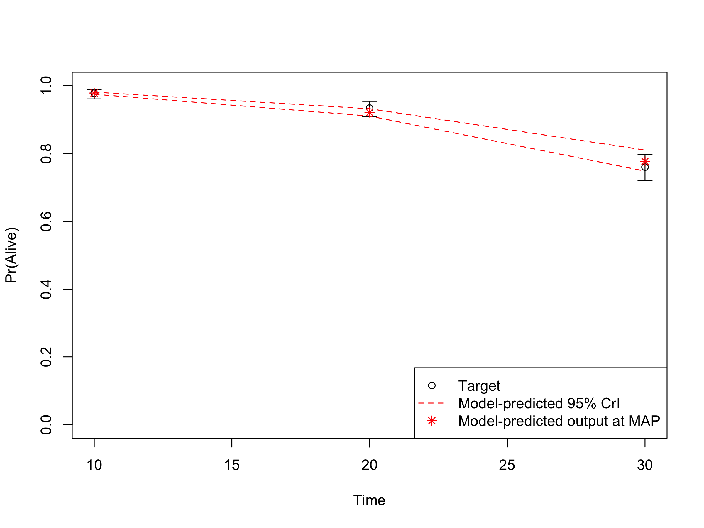
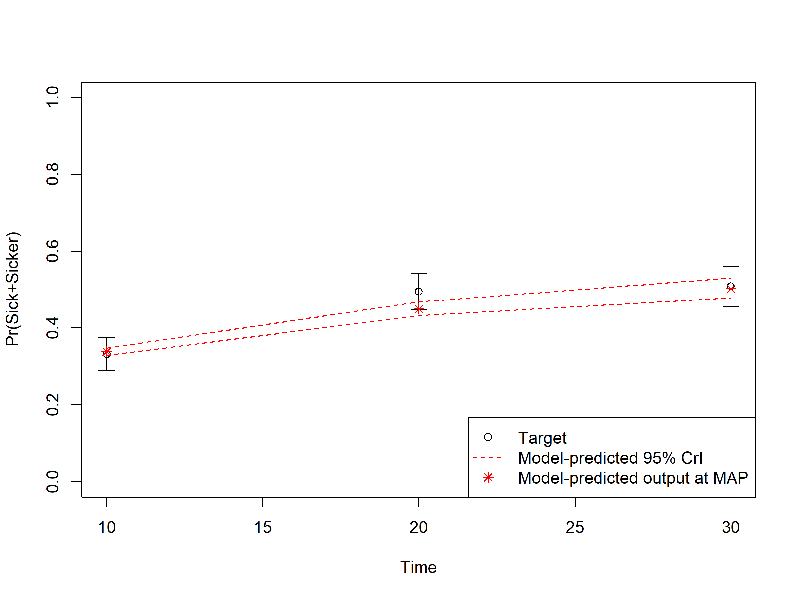
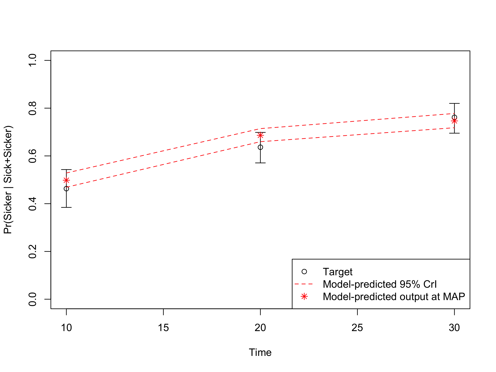

```{r, include = FALSE}
knitr::opts_chunk$set(
  collapse = TRUE,
  comment = "#>"
)
```

```{r, include = FALSE, warning = FALSE}
library(knitr)
# https://haozhu233.github.io/kableExtra/awesome_table_in_html.html
library(kableExtra)
library(dplyr)
library(reshape2)
library(ggplot2)
library(darthpack)
```

# Validation  {#validation}

Model validation is performed to determine "whether a model is sufficiently credible, accurate, and reliable to be used for its intended applications"[@Alarid-Escudero2019d]

In this fourth component, we internally validated the calibrated model by comparing the predicted outputs from the model evaluated at the calibrated parameters against the calibration targets [@Eddy2012, @Goldhaber_Fiebert2010, @Vemer2013, @Kopec2010, @Oberkampf2004]. It is important to check the internal validity of our Sick-Sicker model before we move on to the analysis components. To internally validate the Sick-Sicker model, we compare the model-predicted output evaluated at posterior parameters against the calibration targets. This is all done in the *04_validation.R* script in the `analysis` folder. 

In section _04.2 Compute model-predicted outputs_, we compute the model-predicted outputs for each sample of posterior distribution as well as for the MAP estimate. We then use the function `data_summary` to summarize the model-predicted posterior outputs into different summary statistics. 
```{r}
print.function(data_summary)
```
This function is informed by three arguments, `data`, `varname` and `groupnames`.

The computation of the model-predicted outputs using the MAP estimate is done by inserting the `v_calib_post_map` data into the previously described `calibration_out` function. This function creates a list including the estimated values for survival, prevalence and the proportion of sicker individuals at cycles 10, 20 and 30. 

In sections _04.6 Internal validation: Model-predicted outputs vs. targets_, we check the internal validation by plotting the model-predicted outputs against the calibration targets (Figures \@ref(fig:04-surv)-\@ref(fig:04-proportion)). The generated plots are saved as .png files in the `figs` folder. These files can be used in reports without the need of re-running the code. 

```{r 04-surv, fig.cap="Survival data: Model-predicted outputs vs targets.", out.width='100%', echo = FALSE }

```

```{r 04-prevalence, fig.cap = "Prevalence data of sick individuals: Model-predicted output vs targets.",out.width='100%', echo=FALSE}

```

```{r 04-proportion, fig.cap="Proportion who are Sicker, among all those afflicted (Sick + Sicker): Model-predicted output.", out.width='100%', echo = FALSE}

```

# References {-}
