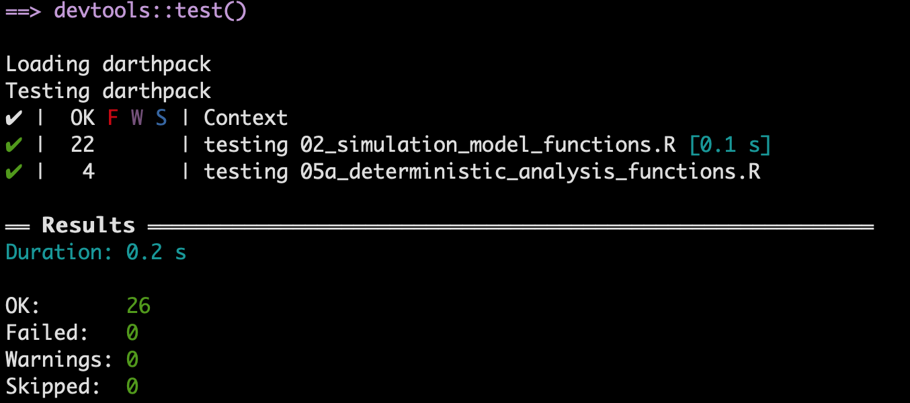

```{r, include = FALSE}
knitr::opts_chunk$set(
  collapse = TRUE,
  comment = "#>"
)
```

```{r, message=FALSE, echo=FALSE, warning=FALSE}
library(darthpack)
library(dplyr)
library(testthat)
```

In this section, we use `testthat` package to demonstrate unit testing [@testthat]. We first show the test structure used in the `testthat` package. We then demonstrate some unit tests for the functions in `02_simulation_model_functions.R`. 

# Test structure

A test file is a `.R` script and is normally stored separately from the source code. In the development of the Sick-Sicker project, we create a `tests` folder for all the test files. In practice, a developer often creates a test file corresponding to a file of source code. Because the functionalities in an R script are usually related, the tests in the corresponding test file naturally go together. A test file consists of three components from the lowest to the highest levels: <span style="color:blue">expectation</span>, <span style="color:blue">test</span> and <span style="color:blue">context</span> [@testthat]. 

* In general, an expectation is to verify whether or not part of a function or a process works as expected. 
* A test, consisting of a collection of exceptions, specifies which function or which part of a function is tested. 
* A context groups tests for related functionalities. 

An expectation is where the developer checks the expected behavior of the function or process of interest. For each expectation, we follow this coding flow: 
  
* Generate the test data for/from the function or process of interest. 
* Hypothesize an expected effect of the function or process of interest. 
* Use `expect_` functions to verify whether the test data is as expected. 

The following coding structure is a general structure in a test file: 

```
context("testing whether the man in black (MIB) is a robot")

## 1st test
test_that("# of times MIB visited the Westworld", {
  # Generate test data. This might be a result from a function or a process. 
  a <- number_of_time_from_MIB_memory()
  # An expected effect / value that might generated from the code that is under testing. 
  b1 <- 1000
  expect_that(a, equals(b1)) # this is equivalent to expect_equal() in testthat
  
  # Use a different expected effect / value from the code that is tested. 
  b2 <- number_of_time_dolores_met_MIB_in_the_park()
  expect_true(a >= b2) 
})

## 2nd test
test_that("# of hosts MIB killed", {
  # Generate test data
  a <- record_in_MIB_memory()
  # Get the expected value from a different function 
  b <- record_store_in_Westworld()
  expect_equal(a, b)
})

## 3rd test
test_that("MIB's real name", {
  ...
})
```

The text in the `context` function provides the name of the group of tests. By convention, one test file contains one `context()`, but the file can include more than one `context()`. Similarly, the text in the `test_that` function indicates which groups of expectations are being executed. After running the test files in the `R` console, the console would display whether the group of tests passed or failed. These texts in `context` and `test_that` would appear, allowing developers to quickly locate where the tests go wrong. 

# Example

The file `02_simulation_model_functions.R` includes function `decision_model`, which is the core code of the Markov model in the Sick-Sicker study. We show some example tests for `decision_model` here. In the following code, we test whether invalid input data evokes certain error message. 

```{r}
context("testing 02_simulation_model_functions.R")

# get data for the input of decision_model()
l_params_all <- load_all_params()

# tests
test_that("invalid inputs", {

  # We use an inaccurate input to raise a specific error message 
  # "Not all the age in the age range have a corresponding mortality rate" 
  l_params_all$n_t <- 90
  expect_error(decision_model(l_params_all), 
               "Not all the age in the age range have a corresponding mortality rate")
  
  
  # We use an inaccurate input to raise a specific error message 
  # "vector of initial states (v_s_init) is not valid" 
  l_params_all$n_t <- 75
  l_params_all$v_s_init <- c(H = -1, S1 = 0, S2 = 0, D = 0)
  expect_error(decision_model(l_params_all), 
               "vector of initial states \\(v_s_init\\) is not valid")
})
```

To test invalid inputs for `decision_model`, we need to pass the input data to the function by loading the parameters. In the tests, we use invalid value for an input parameter that guarantees an error message. Because we expect an error to occur, we use `expect_error` to assert whether `decision_model(l_params_all)` generates the same error message as expected. Because we create invalid inputs to meet these expectation of error message, running this block of code will not raise any error in the console. 

Here is another group of tests checking on the output of `decision_model`. We use more `expect_` functions to check different aspects of the outputs, including the number of components, the naming, the values, etc. 

```{r}
test_that("correct outputs", {
  ## generate output data from decision_model
  output <- decision_model(l_params_all, err_stop = F, verbose = F)
  
  ## checking overall outputs
  # check the number of elements in the output
  expect_equal(length(output), 2)
  # check whether both the outputs are array type
  expect_true(all(unlist(lapply(output, is.array))))
  # check whether the output names are identical as expected 
  expect_identical(names(output), c("a_P", "m_M"))
  
  ## checking output 1: a_P (the transition probability array)
  # check whether the dimension of a_P is as expected
  expect_equal(dim(output[[1]]), 
               c(l_params_all$n_states, l_params_all$n_states, l_params_all$n_t))
  # check whether all the transition probability is between 0 and 1
  expect_true(all(output[[1]] >= 0) | all(output[[1]] <= 1))
  # check whether all rows of each transition matrix sum up to 1 (sum_to_1)
  # because the sums are not numerically equal to 1, we made some adjustment (correct_small_digits)
  sum_to_1 <- apply(output[[1]], c(1, 3), function(x) sum(x)) 
  correct_small_digits <- round(sum_to_1 * 100) / 100
  expect_true(all(correct_small_digits == 1))
  
  ## checking output 2: m_M (trace matrix)
  # check whether the dimension of m_M is as expected
  expect_equal(dim(output[[2]]), 
               c(l_params_all$n_t + 1, l_params_all$n_states))
  # check whether each row in m_M sums up to 1 (sum_to_1)
  # because the sumes are not numerically equal to 1, we made some adjustment (correct_small_digits)
  sum_to_1 <- rowSums(output[[2]])
  correct_small_digits <- round(sum_to_1 * 100) / 100
  expect_true(all(correct_small_digits == 1))
  expect_true(all(output[[2]] >= 0 & output[[2]] <= 1))
})
```

In the test file, we also include tests for the other two functions `check_transition_probability` and `check_sum_of_transition_array`. In addition, we made another testing file `test_05a_deterministic_analysis_functions.R` for function `calculate_ce_out`. 


# Run tests

There are multiple ways to run test files with `testthat` in R. 

## Run each file directly

In this case, the library `testthat` should be attached before running a test file. If all tests in the file passed (that is, all expectations are met), no error messages are raised in the console. However, sometimes the developer might loss count of the number of tests or loss track of the type of tests. This method is not informative in informing how many tests passed, and where the error occurs if tests failed. 

## Run test files at once for an R project / package

For an R package, the developer can run all the test files using shortcut `Ctrl/Cmd+Shift+T` or type R command `testthat::test_dir("path/to/the/tests/folder")` in the console. The shortcut does not work for an R project. RStudio will then provide a summary of passed, failed, and skipped tests. 

{width=500px}

We could see tests are grouped by context, and all our 27 tests passed. 

# References {-}
